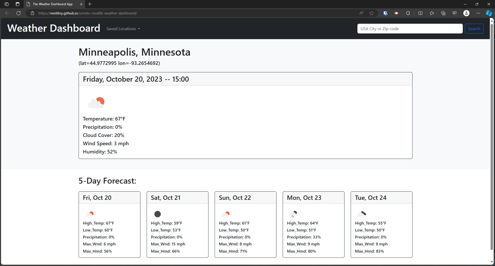

# Module 6 Challenge - Weather Dashboard
*University of Minnesota - Coding Boot Camp*

## Description

#### Retrieves and displays 5-day weather forecast for cities using the OpenWeather API.
- The app features a responsive user interface powered by jQuery and Bootstrap
- Displays current local time using [Day.js](https://day.js.org/en/)
- User can search for a city to generate its weather forecast using the [OpenWeather API](https://openweathermap.org/api)
- Uses `localStorage` to store searched for cities.

## Installation

N/A

## Usage

#### Deployed Site: https://nestibry.github.io/umnbc-mod06-weather-dashboard/

#### Files: 
    Bootstrap: index.html
    jQuery: ./assets/js/script.js
    Extra Styling: ./assets/css/style.css

#### Figure: Weather Dashboard Example

 
## Credits
- [Day.js](https://day.js.org/en/)
- [OpenWeather API](https://openweathermap.org/api)
- © 2023 edX Boot Camps LLC.

## License

- [MIT License](https://choosealicense.com/licenses/mit/)

